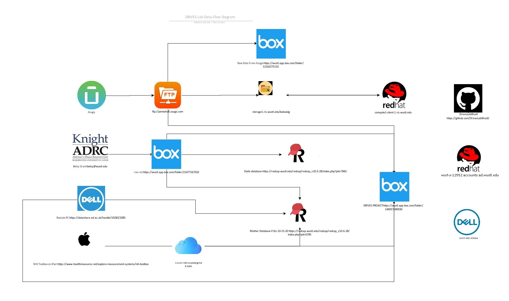

# Infrastructure

{width=100%}

The [Data-Flow Diagram.vsdx](img/Data-Flow Diagram.vsdx) can be edited for free at [aspose.app](https://products.aspose.app/diagram/editor).

## Sources

### Azuga

Driving data is collected from study participants via an [Azuga](https://www.azuga.com/) GPS device plugged into their vehicle's [OBD](https://en.wikipedia.org/wiki/On-board_diagnostics) port.

Azuga pushes files daily to their [ftp server](ftp://pentaho8.azuga.com).

This server can be accessed via plain FTP (insecure). Credentials are available in the credential store.

### Knight ADRC

The [Charles F. and Joanne Knight Alzheimer Disease Research Center (Knight ADRC)](https://knightadrc.wustl.edu/) supports researchers and the surrounding community in the pursuit of answers that will lead to improved diagnosis and care for persons with Alzheimer disease (AD). The Center is committed to the long-term goal of finding a way to effectively treat and prevent AD.

Our contact in [Betsy Grant](mailto:betsy@wustl.edu).

### Lab iPad

The iPad is used to administer select measures from the [NIH Toolbox](https://www.healthmeasures.net/explore-measurement-systems/nih-toolbox).

### RoeLab-PC

The RoeLab-PC is used to collect [Deary-Liewald Reaction time](https://datashare.ed.ac.uk/handle/10283/2085) data.

## Storage

### iCloud

The lab iPad is backed up to iCloud.

### Box Folder - roe ro1

Betsy shares ADRC files [here](https://wustl.app.box.com/folder/21477167502).

### Box Folder - Raw Data from Azuga

A script monitors the Azuga ftp server and copies the files [here](https://wustl.app.box.com/folder/51542575135).

### Box Folder - DRIVES PROJECT

Various scripts and programs backup all data [here](https://wustl.app.box.com/folder/144057580030).

## REDCap

### Static Database

The [Static database](https://redcap.wustl.edu/redcap/redcap_v10.6.28/index.php?pid=7842) contains demographic information on study participants.

### Mother Database

The [Mother Database-FULL-10-15-20](https://redcap.wustl.edu/redcap/redcap_v10.6.28/index.php?pid=6785) contains temporal data on study participants.

## Research Infrastructure Services

Washington University Information Technology’s [Research Infrastructure Services](https://ris.wustl.edu/) mission is to facilitate discovery of knowledge and enhance educational opportunities by providing secure, sustainable, scalable, and integrated research technology services in a collaborative and diverse environment.

### Data Storeage Platform

The [Data Storage Platform](https://ris.wustl.edu/services/research-storage/) is a scalable, high-performance and distributed storage infrastructure with integrated long-term archiving capabilities. There are many enterprise level features to facilitate data analysis, management, curation and retention.  All faculty involved in research have access to 5TB of free Active storage.

### Scientific Compute Platform

The [Scientific Compute Platform](https://ris.wustl.edu/services/compute/) provides WashU research faculty access to computing resources and a job scheduler that runs large-scale, parallel computing tasks with access to many CPU and GPU cores, large amounts of RAM, high-speed networks, and high-performance storage systems.

The service is centered around container technologies (e.g. Docker) to allow complex software environments to be deployed independently from other users while isolating complicated software dependencies. The Scientific Compute Platform aims to be well integrated with the Data Storage Platform, the Research Applications Platform, and Cloud Services, providing an ability to expand computational resources to integrated cloud solutions.

The documentation is found [here](https://docs.ris.wustl.edu/).

## Github

Github is used to store code and other documents [here](https://github.com/DrivesLabWustl).

Examples include the lab R package `{driver}`, the source code for these notes, the laboratory scripts, and a SAS macro library.

## Linux Server

Azuga data is loaded into an [MariaDB](https://mariadb.org/) database on [wuit-s-12552.accounts.ad.wustl.edu](https://wuit-s-12552.accounts.ad.wustl.edu).

The server also runs [apache](https://httpd.apache.org/) to host these notes.

## GIS Computer

A lab computer called 3255-WD-05064 is used to run backup scripts that will eventually be ported to the Linux server.
